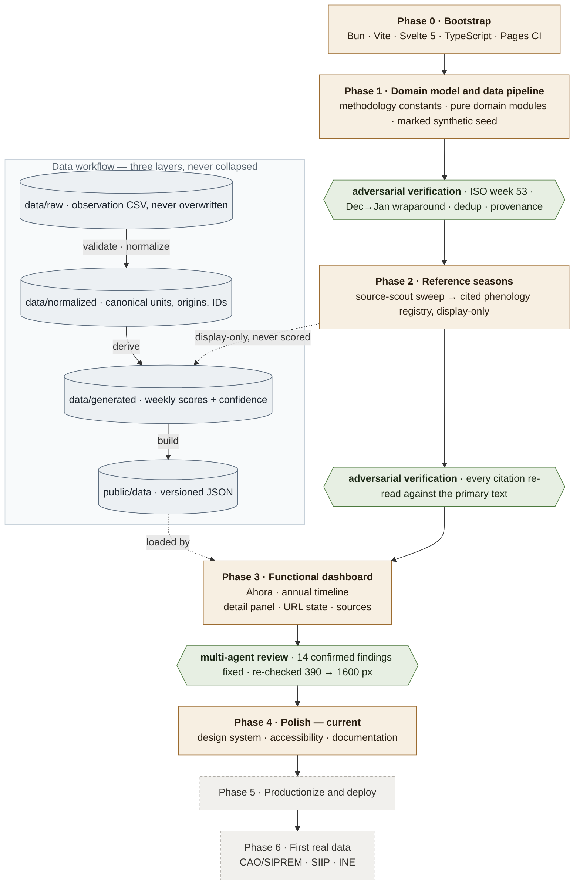

# Temporada Santa Cruz

**Cuándo comprar frutas y verduras en Santa Cruz — basado en oferta, precios,
procedencia y cosechas reales.**

A public, open-data web dashboard about produce seasonality in Santa Cruz de
la Sierra, Bolivia: what is in season now, when each product peaks, when it is
cheapest, where it comes from, and — always — how confident the data allows us
to be.

> **Status: Phases 0–3 complete, Phase 4 (polish) in progress.** The data
> pipeline and the dashboard run end to end on a clearly-marked synthetic seed
> dataset; importing real market reports is Phase 6. See
> [docs/PLAN.md](docs/PLAN.md) for the execution plan and
> [PROJECT.md](PROJECT.md) for the full specification.

## Build workflow

The project is built one phase per session. Every phase that produces data or
domain logic is closed by an adversarial multi-agent pass before the next one
starts — nothing enters `data/raw/` or the scoring path unverified.



Two invariants hold across the whole diagram: raw observations are never
destroyed or overwritten, and every derived value traces back to the
observations and source IDs behind it. Bibliographic reference seasons attach
at the derive step for display only — they never touch a score, a confidence
value, or a current-week claim.

## Stack

Bun · Vite · Svelte 5 (runes) · TypeScript · GitHub Pages

## Develop

```bash
bun install
bun run dev      # local dev server
bun run check    # svelte-check + tsc
bun run test     # Vitest
bun run data     # validate → normalize → derive → build into public/data/
bun run build    # production build to dist/
```

The Vite base path defaults to `/`. For GitHub Pages project deployments the
CI workflow sets `VITE_BASE_PATH="/temporada-santa-cruz/"`; a future custom
domain sets it back to `/`. See `vite.config.ts`.

## License

- Code: [MIT](LICENSE)
- Curated and derived datasets: [CC BY 4.0](LICENSE-DATA.md)
- Raw source material remains subject to its original publishers' terms.
